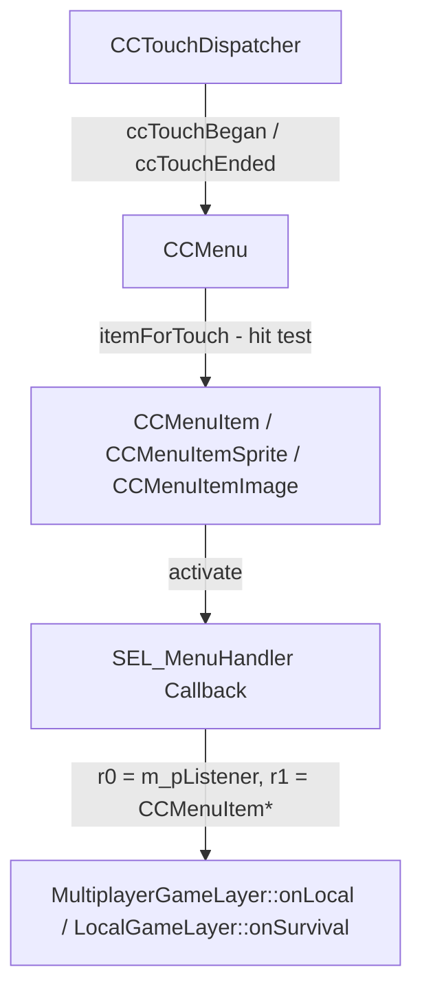

# Mini Militia Automation via Cocos2d-x 2.2 Internal UI & ADB

## Goal Description
Automate Mini Militia game navigation without manual UI clicks by directly leveraging Cocos2d-x 2.2 internal UI mechanisms (`CCMenuItem::activate` or direct layer member functions `MultiplayerGameLayer::onLocal` and `LocalGameLayer::onSurvival`) combined with ADB controls.

---

## Cocos2d-x 2.2 Internal UI Architecture & Button Mechanism

In Cocos2d-x 2.2:



### 1. How Buttons Work in Cocos2d-x 2.2
1. **Creation & Target-Action Binding**:
   ```cpp
   CCMenuItemImage *item = CCMenuItemImage::create(
       "normal.png", "selected.png",
       pTarget, // Stored at offset +0xf4 (m_pListener)
       menu_selector(MultiplayerGameLayer::onLocal) // Stored at +0xf8 (m_pfnSelector)
   );
   ```
2. **`CCMenuItem` Structure (from Ghidra Decompilation at `0x006e95a4`)**:
   - `+ 0xf3`: `m_bIsEnabled` (`bool`)
   - `+ 0xf4`: `m_pListener` (`CCObject*` -> Layer `this` pointer)
   - `+ 0xf8`: `m_pfnSelector` (`SEL_MenuHandler` -> function pointer `onLocal` / `onSurvival`)
3. **`CCMenuItem::activate()` Execution (`0x006e95a4`)**:
   ```cpp
   void CCMenuItem::activate() {
       if (this->m_bIsEnabled) {
           if (this->m_pListener && this->m_pfnSelector) {
               // In ARM AAPCS: r0 = m_pListener, r1 = this (CCMenuItem*)
               (this->m_pListener->*this->m_pfnSelector)(this);
           }
       }
   }
   ```
4. **Debounce / Transition Guard (`Layer + 0x108`)**:
   Inside `MultiplayerGameLayer::onLocal` (`0x00428c18`) and `LocalGameLayer::onSurvival` (`0x003ea3e4`):
   - Offset `+0x108` on the Layer (`this`) is a single-byte lock flag (`m_bLocked`).
   - If `*(uint8_t*)(this + 0x108) == 0`: proceeds with sound, state update, sets flag to `1`, and calls `CCDirector::sharedDirector()->replaceScene(...)`.
   - Parameter `r1` (`pSender` / `CCObject*`) is saved to stack and **never read or used**.

---

## Automation Approaches Comparison

| Approach | How it works | Pros | Cons |
| :--- | :--- | :--- | :--- |
| **A. Direct Method Call (Recommended)** | Call `onLocal(layer_ptr, NULL)` & `onSurvival(layer_ptr, NULL)` | Simple, minimal overhead, exact targets specified | Requires capturing layer `this` pointers |
| **B. `CCMenuItem::activate()`** | Traverse `CCDirector::getRunningScene()` children and invoke `item->activate()` | Triggers standard Cocos2d-x event flow | Slightly more complex node tree traversal |
| **C. Scene Replacement** | Directly instantiate `FindGameLayer::scene()` or `StageLayer::scene()` | Bypasses menu layer state entirely | Might bypass side effects (LAN setup, sound, globals) |

We will use **Approach A** (Direct Method Call) with automated instance capture and lock-flag reset (`*(this + 0x108) = 0`).

---

## Step-by-Step Execution Plan

### Step 1: ADB App Launch
- Command: `adb shell monkey -p com.appsomniacs.da2 -c android.intent.category.LAUNCHER 1`
- Or: `adb shell am start -n com.appsomniacs.da2/com.appsomniacs.da2.MainActivity`

### Step 2: ADB Tap to Dismiss Splash
- Command: `adb shell input tap 500 500` (press anywhere on screen)

### Step 3: Wait 5 Seconds
- Allow main menu / multiplayer menu initialization.

### Step 4: Call `MultiplayerGameLayer::onLocal`
- Mangled name: `_ZN20MultiplayerGameLayer7onLocalEPN7cocos2d8CCObjectE`
- Pass `r0 = multiplayerLayerInstance`, `r1 = NULL (0x0)`
- Ensures `*(uint8_t*)(multiplayerLayerInstance + 0x108) = 0`

### Step 5: Wait 3 Seconds
- Allow slide-in scene transition (`CCTransitionSlideInR`) to complete and load `LocalGameLayer`.

### Step 6: Call `LocalGameLayer::onSurvival`
- Mangled name: `_ZN14LocalGameLayer10onSurvivalEPN7cocos2d8CCObjectE`
- Pass `r0 = localLayerInstance`, `r1 = NULL (0x0)`
- Ensures `*(uint8_t*)(localLayerInstance + 0x108) = 0`

---

## Proposed Code Structure

### 1. `simpletests/loadingGame/nav_hooks.js` (Frida Agent)
```javascript
'use strict';

const MODULE_NAME = "libcocos2dcpp.so";
let multiplayerLayerPtr = null;
let localLayerPtr = null;

// Track layer instances
Interceptor.attach(Module.findExportByName(MODULE_NAME, "_ZN20MultiplayerGameLayerC2Ev") ||
                   Module.findExportByName(MODULE_NAME, "_ZN20MultiplayerGameLayerC1Ev"), {
    onLeave: function (retval) {
        multiplayerLayerPtr = this.context.r0;
        console.log("[Frida] MultiplayerGameLayer instance:", multiplayerLayerPtr);
    }
});

Interceptor.attach(Module.findExportByName(MODULE_NAME, "_ZN14LocalGameLayerC2Ev") ||
                   Module.findExportByName(MODULE_NAME, "_ZN14LocalGameLayerC1Ev"), {
    onLeave: function (retval) {
        localLayerPtr = this.context.r0;
        console.log("[Frida] LocalGameLayer instance:", localLayerPtr);
    }
});

rpc.exports = {
    callOnLocal: function () {
        if (!multiplayerLayerPtr) return { success: false, error: "MultiplayerGameLayer instance not captured yet" };
        const onLocalAddr = Module.findExportByName(MODULE_NAME, "_ZN20MultiplayerGameLayer7onLocalEPN7cocos2d8CCObjectE");
        const onLocal = new NativeFunction(onLocalAddr, 'void', ['pointer', 'pointer']);
        
        // Reset lock flag if set
        multiplayerLayerPtr.add(0x108).writeU8(0);
        onLocal(multiplayerLayerPtr, ptr(0));
        return { success: true };
    },
    callOnSurvival: function () {
        if (!localLayerPtr) return { success: false, error: "LocalGameLayer instance not captured yet" };
        const onSurvivalAddr = Module.findExportByName(MODULE_NAME, "_ZN14LocalGameLayer10onSurvivalEPN7cocos2d8CCObjectE");
        const onSurvival = new NativeFunction(onSurvivalAddr, 'void', ['pointer', 'pointer']);
        
        // Reset lock flag if set
        localLayerPtr.add(0x108).writeU8(0);
        onSurvival(localLayerPtr, ptr(0));
        return { success: true };
    }
};
```

### 2. `simpletests/loadingGame/test_menu_navigation.py` (Python Orchestrator)
Orchestrates:
1. `subprocess.run(["adb", "shell", "am", "start", ...])`
2. `subprocess.run(["adb", "shell", "input", "tap", ...])`
3. Attaches Frida session to Mini Militia process.
4. Calls `script.exports_sync.call_on_local()` after 5s.
5. Calls `script.exports_sync.call_on_survival()` after 3s.

---

## Verification Plan

### Automated / Script Run
```powershell
python simpletests/loadingGame/test_menu_navigation.py
```

### Manual Check
- Verify game transitions cleanly from Main/Multiplayer screen -> Local Game Screen -> Survival Stage selection without UI clicks.
